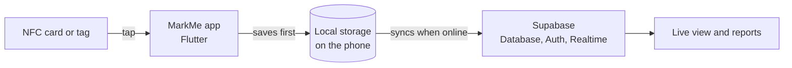

<div align="center">


<a href="https://inmarkme.vercel.app/">
  
</a>

<br />

[](https://inmarkme.vercel.app/)
[](#patent)
[](#)
[](#get-started)


<br />

<a href="#features"></a>
<a href="#patent"></a>
<a href="#how-it-works"></a>
<a href="#tech-stack"></a>
<a href="#get-started"></a>
<a href="#roadmap"></a>

</div>

<br />

https://github.com/user-attachments/assets/72c830d3-b4bd-42c7-a330-d9b369b88f5d

<br />

<div align="center">


<a href="https://github.com/GoyalKrish/markmeSupabase"></a>

</div>

---

## Why MarkMe

Taking attendance by hand wastes time. Sheets get lost, roll calls eat into class, and event entrances turn into long queues.

MarkMe replaces all of that with a single tap. Everyone carries an NFC card. The organizer taps it on their phone, the record is saved instantly, and the numbers show up live.

| The old way | With MarkMe |
|---|---|
| Paper sheets and roll calls | One tap on an NFC card |
| Manual counting and typing into spreadsheets | Records saved automatically |
| Stops working when the network drops | Works offline and syncs later |
| Results come hours later | Live numbers and shareable reports |

---

## Features

<table>
  <tr>
    <td width="33%" valign="top">
      <h3>⚡ Tap to mark</h3>
      Read an NFC card or tag with the phone. Attendance is recorded straight away.
    </td>
    <td width="33%" valign="top">
      <h3>📴 Offline first</h3>
      Everything is saved on the phone first, then synced to the cloud when internet returns.
    </td>
    <td width="33%" valign="top">
      <h3>📡 Live tracking</h3>
      Organizers watch attendance build up in real time.
    </td>
  </tr>
  <tr>
    <td valign="top">
      <h3>📊 Reports</h3>
      View and share attendance data after the event or class.
    </td>
    <td valign="top">
      <h3>🔐 Secure accounts</h3>
      Every organizer signs in with their own account.
    </td>
    <td valign="top">
      <h3>🗂️ Folders and lobbies</h3>
      Keep different classes and events neatly separated.
    </td>
  </tr>
  <tr>
    <td valign="top">
      <h3>🏟️ Proven in the field</h3>
      Used at 4 live events with 1,200+ attendees.
    </td>
    <td valign="top">
      <h3>📱 Published</h3>
      Available on the Indus App Store.
    </td>
    <td valign="top">
      <h3>🧬 Patent pending</h3>
      The core technology has a filed patent application.
    </td>
  </tr>
</table>

---

<a id="patent"></a>

## Patent

> [!IMPORTANT]
> The NFC-based attendance technology behind MarkMe is the subject of a filed patent application.
>
> **Patent Application No. 202511016597** (Patent Pending)

<!-- Say "Patented" only after the patent is officially granted. Until then, "Patent Pending" is the correct wording. -->

---

## How it works



1. The organizer signs in and opens a folder or lobby.
2. Attendees tap their NFC card on the phone.
3. The record is saved on the phone right away, so nothing is lost on a weak network.
4. When online, it syncs to Supabase and the live view and reports update.

---

## Tech stack

<div align="center">


</div>

<br />

| Area | Technology | Purpose |
|---|---|---|
| App | **Flutter** (Dart 3) | One codebase for Android, iOS and more |
| Backend | **Supabase** (`supabase_flutter`) | Database, sign-in and live updates |
| NFC | `nfc_manager` | Reads NFC cards and tags |
| Navigation | `go_router` | Moves between screens |
| State | `provider` | Keeps data in sync across screens |
| Offline storage | `shared_preferences` | Saves data on the phone |
| Config | `flutter_dotenv` | Keeps settings in a `.env` file |
| Files and sharing | `share_plus`, `file_picker`, `path_provider` | Share and pick files |
| Device | `device_info_plus`, `uuid` | Device details and unique IDs |
| UI polish | `google_fonts`, `lottie`, `flutter_svg`, `flutter_native_splash` | Fonts, animations, icons, splash screen |

---

## Get started

**You need:** [Flutter](https://docs.flutter.dev/get-started/install) (Dart 3+), an **Android phone with NFC** (emulators cannot read NFC), and a free [Supabase](https://supabase.com) project.

```bash
# 1. Get the code
git clone https://github.com/GoyalKrish/markmeSupabase.git
cd markmeSupabase

# 2. Install packages
flutter pub get

# 3. Add your settings
cp .env.example .env

# 4. Run on a connected phone
flutter run
```

Fill in `.env` with your own Supabase details:

```env
SUPABASE_URL=your-project-url
SUPABASE_ANON_KEY=your-public-anon-key
```

> [!WARNING]
> The build needs this file to exist. Use only the public **anon** key, never a `service_role` key,
> because anything inside an app can be extracted. Protect your data with Supabase Row Level Security.

Run the tests with `flutter test`.

---

## Backend

The `Backend/` folder holds the Supabase side of the project.

<!-- TODO: add 3-5 lines about what is inside Backend/, for example:
     - database tables and how they connect (folders, lobbies, attendance records)
     - security rules (Row Level Security)
     - SQL or functions, and how to apply them to a new Supabase project -->

---

<details>
<summary><b>Project structure</b></summary>

```
markmeSupabase/
├── lib/          # Flutter app code
├── Backend/      # Supabase backend files
├── assets/       # Images and icons
├── test/         # Automated tests
├── android/      # Android project
├── ios/          # iOS project
├── web/          # Web build support
├── windows/  linux/  macos/   # Desktop support (generated by Flutter)
└── pubspec.yaml  # App settings and dependencies
```

</details>

<a id="roadmap"></a>

## Roadmap

Tracked openly in the [Issues](https://github.com/GoyalKrish/markmeSupabase/issues) tab:

- [ ] Change password inside the app
- [ ] Push notifications
- [ ] In-app "new version available" notice
- [ ] Automated release to the Indus App Store
- [ ] Better handling of one account on several devices
- [ ] Limit the length of folder and lobby names
- [ ] Track which app versions people use

---

<div align="center">

### Built by Krish Goyal

B.Tech Computer Science student at Sharda University.
Backend-minded, systems-curious, and always shipping.

[](https://krishgoyal.vercel.app)
[](https://linkedin.com/in/goyalkrish)
[](https://github.com/GoyalKrish)


</div>
