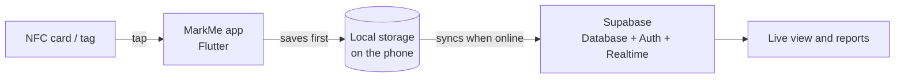

<div align="center">

# MarkMe

### Attendance in one tap. Just tap an NFC card on the phone.

A mobile app that lets universities and event teams mark attendance by tapping NFC cards.
It keeps working without internet and syncs to the cloud when the connection comes back.

[](https://inmarkme.vercel.app/)


</div>

---

## The problem

Taking attendance by hand is slow. Paper sheets get lost, roll calls waste class time, and at big events
long queues form at the entrance.

## The solution

MarkMe turns attendance into a single tap. Each person carries an NFC card. The organizer taps it on
their phone, and the attendance is recorded straight away. Organizers can then see live numbers and
reports instead of counting sheets.

---

## Features

- **Tap to mark attendance:** read an NFC card or tag with the phone.
- **Works offline:** attendance is saved on the phone first, then synced to the cloud when internet is available.
- **Live tracking:** organizers see attendance as it happens.
- **Reports:** view and share attendance data.
- **Accounts and sign-in:** each organizer has their own login.
- **Organized by folders and lobbies:** keep different classes or events separate.
- **Tested for real:** used at 4 live events with 1,200+ attendees.
- **Published:** available on the Indus App Store.

---

## How it works



1. The organizer signs in and opens a folder or lobby.
2. Attendees tap their NFC card on the phone.
3. The app saves the record on the phone right away, so nothing is lost if the network is slow.
4. When online, the record is synced to Supabase, and the live view and reports update.

---

## Tech stack

| Area | What is used | Why |
|---|---|---|
| App | **Flutter** (Dart 3) | One codebase for Android, iOS and more |
| Backend and database | **Supabase** (`supabase_flutter`) | Hosted database, sign-in and live updates |
| NFC | `nfc_manager` | Reads NFC cards and tags |
| Navigation | `go_router` | Moves between screens |
| State management | `provider` | Keeps the app's data in sync across screens |
| Local storage | `shared_preferences` | Stores data on the phone for offline use |
| Config | `flutter_dotenv` | Keeps settings in a `.env` file |
| Sharing and files | `share_plus`, `file_picker`, `path_provider` | Share and pick files |
| Device info | `device_info_plus`, `uuid` | Identify the device and create unique IDs |
| Look and feel | `google_fonts`, `lottie`, `flutter_svg`, `flutter_native_splash` | Fonts, animations, icons and splash screen |

---

## Project structure

```
markmeSupabase/
├── lib/         # The Flutter app code (screens, logic, services)
├── Backend/     # Supabase backend files
├── assets/      # Images and icons
├── test/        # Automated tests
├── android/     # Android project
├── ios/         # iOS project
├── web/         # Web build support
├── windows/  linux/  macos/   # Desktop build support (generated by Flutter)
└── pubspec.yaml # App settings and dependencies
```

---

## Getting started

### What you need

- [Flutter](https://docs.flutter.dev/get-started/install) (Dart 3 or newer)
- An **Android phone with NFC** to test tapping (emulators cannot read NFC)
- A free [Supabase](https://supabase.com) project

### Steps

```bash
# 1. Get the code
git clone https://github.com/GoyalKrish/markmeSupabase.git
cd markmeSupabase

# 2. Install packages
flutter pub get

# 3. Add your settings (see below)
cp .env.example .env

# 4. Run on a connected phone
flutter run
```

### Settings (`.env`)

Create a `.env` file in the project root with your own Supabase details:

```env
SUPABASE_URL=your-project-url
SUPABASE_ANON_KEY=your-public-anon-key
```

> The app lists `.env` as one of its files, so the build will fail if the file is missing.
> Only use the public **anon** key. Never put a `service_role` key in this file, because anything
> inside the app can be extracted. Protect your data with Supabase Row Level Security instead.

### Run the tests

```bash
flutter test
```

---

## Backend

The `Backend/` folder holds the Supabase side of the project.

<!-- TODO: add 3-5 lines here about what is inside Backend/, for example:
     - database tables and how they connect (folders, lobbies, attendance records)
     - security rules (Row Level Security)
     - any SQL or functions, and how to apply them to a new Supabase project -->

---

## Known gaps and roadmap

These are tracked openly in the [Issues](https://github.com/GoyalKrish/markmeSupabase/issues) tab:

- [ ] Change password inside the app
- [ ] Push notifications
- [ ] In-app "new version available" notice
- [ ] Automated release to the Indus App Store (it is manual today)
- [ ] Better handling of the same account logged in on several devices
- [ ] Limit the length of folder and lobby names
- [ ] Track which app versions people are using

---

## Live site

Learn more about MarkMe at **[inmarkme.vercel.app](https://inmarkme.vercel.app/)**.

---

## Author

**Krish Goyal**, B.Tech Computer Science student at Sharda University.
**Aditya Pandey**, B.Tech Computer Science student at Sharda University.

[Portfolio](https://krishgoyal.vercel.app) · [LinkedIn](https://linkedin.com/in/goyalkrish) · [GitHub](https://github.com/GoyalKrish)

<!-- Optional: add screenshots once you have them. Save images in docs/screenshots/ and uncomment.

## Screenshots

| Home | Tap to mark | Reports |
|---|---|---|
|  |  |  |
-->
